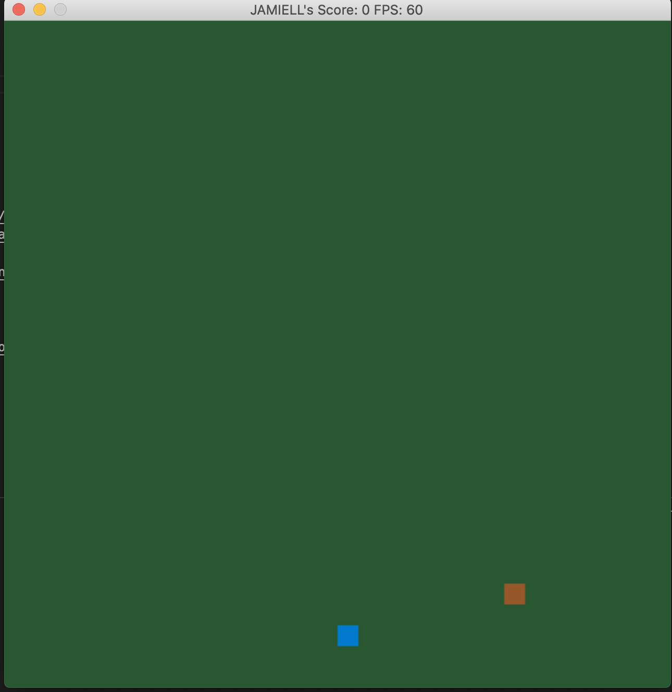
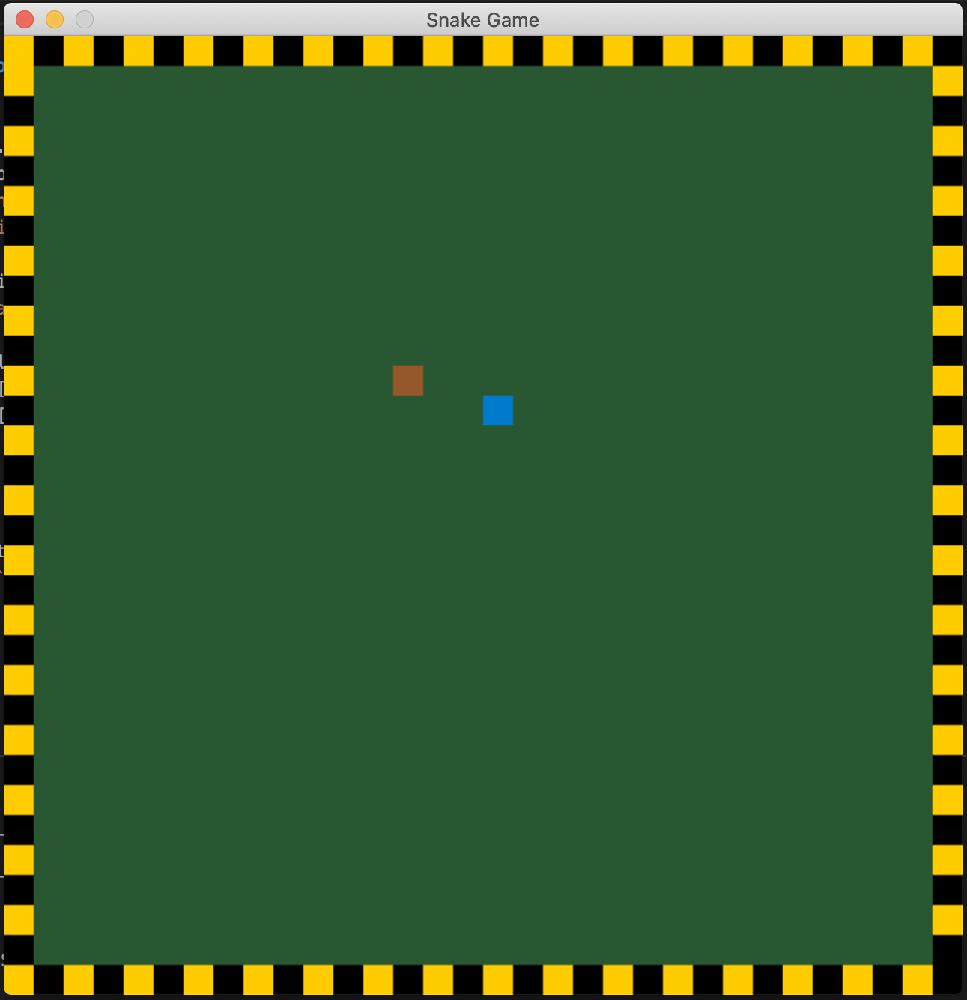

# CPPND: Capstone Snake Game

This is a Capstone project in the [Udacity C++ Nanodegree Program](https://www.udacity.com/course/c-plus-plus-nanodegree--nd213). The code for this repo was inspired by [this](https://codereview.stackexchange.com/questions/212296/snake-game-in-c-with-sdl) excellent StackOverflow post and set of responses.


## Description
The main objective is to eat as much food as possible without dying. As the snake eats food, it gets larger and faster making the game
that more difficult.

In this game, the user will be prompted to enter a player name and level of difficult.


Once this is done, the game window will be rendered. The snake can be controlled by using
the Up, Left, Right and Down arrow keys. 

Difficulty Level One(1)


In this difficulty level, the snake can only die by eating it's body.

Difficulty Level Two(2)


In this difficultly level, the snake will die if it enters the border wall or eats it's body.

## File & Class Structure

```
CPPND-CAPSTONE-SNAKE-GAME
├── CMakeLists.txt
├── README.md
├── cmake
│   └── FindSDL2_image.cmake
├── images
│   ├── image1.png
│   ├── image2.png
│   ├── image3.png
│   └── snake_game.gif
├── include
│   ├── SDL.h
│   ├── SDL_assert.h
│   ├── SDL_atomic.h
│   ├── SDL_audio.h
│   ├── SDL_bits.h
│   ├── SDL_blendmode.h
│   ├── SDL_clipboard.h
│   ├── SDL_config.h
│   ├── SDL_cpuinfo.h
│   ├── SDL_egl.h
│   ├── SDL_endian.h
│   ├── SDL_error.h
│   ├── SDL_events.h
│   ├── SDL_filesystem.h
│   ├── SDL_gamecontroller.h
│   ├── SDL_gesture.h
│   ├── SDL_haptic.h
│   ├── SDL_hints.h
│   ├── SDL_joystick.h
│   ├── SDL_keyboard.h
│   ├── SDL_keycode.h
│   ├── SDL_loadso.h
│   ├── SDL_locale.h
│   ├── SDL_log.h
│   ├── SDL_main.h
│   ├── SDL_messagebox.h
│   ├── SDL_metal.h
│   ├── SDL_misc.h
│   ├── SDL_mouse.h
│   ├── SDL_mutex.h
│   ├── SDL_name.h
│   ├── SDL_opengl.h
│   ├── SDL_opengl_glext.h
│   ├── SDL_opengles.h
│   ├── SDL_opengles2.h
│   ├── SDL_opengles2_gl2.h
│   ├── SDL_opengles2_gl2ext.h
│   ├── SDL_opengles2_gl2platform.h
│   ├── SDL_opengles2_khrplatform.h
│   ├── SDL_pixels.h
│   ├── SDL_platform.h
│   ├── SDL_power.h
│   ├── SDL_quit.h
│   ├── SDL_rect.h
│   ├── SDL_render.h
│   ├── SDL_revision.h
│   ├── SDL_rwops.h
│   ├── SDL_scancode.h
│   ├── SDL_sensor.h
│   ├── SDL_shape.h
│   ├── SDL_stdinc.h
│   ├── SDL_surface.h
│   ├── SDL_system.h
│   ├── SDL_syswm.h
│   ├── SDL_test.h
│   ├── SDL_test_assert.h
│   ├── SDL_test_common.h
│   ├── SDL_test_compare.h
│   ├── SDL_test_crc32.h
│   ├── SDL_test_font.h
│   ├── SDL_test_fuzzer.h
│   ├── SDL_test_harness.h
│   ├── SDL_test_images.h
│   ├── SDL_test_log.h
│   ├── SDL_test_md5.h
│   ├── SDL_test_memory.h
│   ├── SDL_test_random.h
│   ├── SDL_thread.h
│   ├── SDL_timer.h
│   ├── SDL_touch.h
│   ├── SDL_types.h
│   ├── SDL_version.h
│   ├── SDL_video.h
│   ├── SDL_vulkan.h
│   ├── begin_code.h
│   └── close_code.h
└── src
    ├── borderwall.cpp
    ├── borderwall.h
    ├── controller.cpp
    ├── controller.h
    ├── food.cpp
    ├── food.h
    ├── game.cpp
    ├── game.h
    ├── gameobject.cpp
    ├── gameobject.h
    ├── main.cpp
    ├── player.cpp
    ├── player.h
    ├── renderer.cpp
    ├── renderer.h
    ├── snake.cpp
    └── snake.h
```

## Dependencies for Running Locally
* cmake >= 3.7
  * All OSes: [click here for installation instructions](https://cmake.org/install/)
* make >= 4.1 (Linux, Mac), 3.81 (Windows)
  * Linux: make is installed by default on most Linux distros
  * Mac: [install Xcode command line tools to get make](https://developer.apple.com/xcode/features/)
  * Windows: [Click here for installation instructions](http://gnuwin32.sourceforge.net/packages/make.htm)
* SDL2 >= 2.0
  * All installation instructions can be found [here](https://wiki.libsdl.org/Installation)
  * Note that for Linux, an `apt` or `apt-get` installation is preferred to building from source.
* gcc/g++ >= 5.4
  * Linux: gcc / g++ is installed by default on most Linux distros
  * Mac: same deal as make - [install Xcode command line tools](https://developer.apple.com/xcode/features/)
  * Windows: recommend using [MinGW](http://www.mingw.org/)

## Basic Build Instructions

1. Clone this repo.
2. Make a build directory in the top level directory: `mkdir build && cd build`
3. Compile: `cmake .. && make`
4. Run it: `./SnakeGame`.

## Ruberic Points Addressed:

### Loops, Functions, I/O

1. The project demonstrates an understanding of C++ functions and control structures.
   
   C++ functions and control structures demonstrated in entire project. For example, `void BorderWall::CreateWall()`

2. The project reads data from a file and process the data, or the program writes data to a file.

   This is demonstrated in the method `void Player::Save()` where the player's score is written to a file.

3. The project accepts user input and processes the input.
   
   The user is presented with a prompt for a player name and level of difficulty. Please see `void Player::ShowGreeting()`

### Object Oriented Programming

1. The project uses Object Oriented Programming techniques.
   
   This is demonstrated in the entire project. For example, `class Game` or `class Snake`

2. Classes use appropriate access specifiers for class members.
   
   All classes use appropriate access specifiers. See `class BorderWall` for an example.

3. Class constructors utilize member initialization lists.

   Initialization lists are used in `class Snake`, `class Game`, etc...

4. Classes abstract implementation details from their interfaces.

   All class member functions document their effects, either through function names, comments, or formal documentation.
   Please see `render.cpp` for an example.

5. Classes encapsulate behavior.
  
   Appropriate data and functions were grouped into classes. Member data that is subject to an invariant was hidden from the user. 
   state is accessed via member functions. For an example, please see `void Player::SetScore(int score)`.

### Memory Management

1. The project makes use of references in function declarations.

  Two functions that use pass by reference are: `void Render(BorderWall &wall, Snake const snake, Food &food, std::vector<std::vector<SDL_Point>>const &obstacles)` and `void UpdateBody(SDL_Point &current_cell, SDL_Point &prev_cell);`.


2. The project uses destructors appropriately.

  A class that uses a destructor appropriate is `class Render` when cleaning up memory allocated for window creation.


